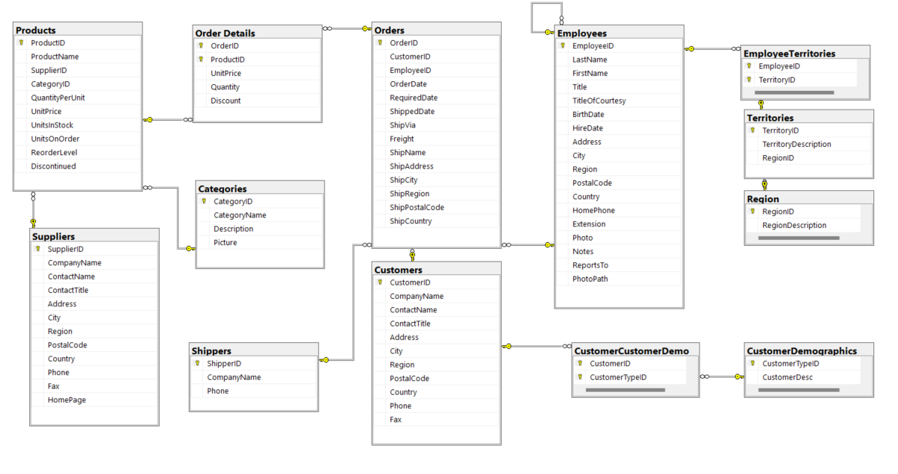

# Northwind Database SQL Queries

A collection of SQL queries and tasks based on the classic Microsoft Northwind sample database. Project demonstrates various SQL skills including data retrieval, aggregation, joins, and complex analytical queries.

## 📊 Project Overview

This repository contains SQL queries written for the Northwind database, showcasing different SQL techniques and problem-solving approaches. The Northwind database is a sample database originally created by Microsoft, containing sales data for a fictitious company called "Northwind Traders" which imports and exports specialty foods from around the world.

## 🗄️ Database Structure

The Northwind database contains the following main entities:
- **Customers** - Customer information
- **Employees** - Employee details and hierarchy
- **Orders** - Order headers with customer and employee references
- **Order Details** - Line items for each order
- **Products** - Product catalog with categories and suppliers
- **Categories** - Product categories
- **Suppliers** - Supplier information
- **Shippers** - Shipping companies

## 📁 Project Structure

├── README.md # Project documentation
├── DatabaseDiagram.png # Visual database schema
├── dataset/ # Database setup files
│ └── instnwnd.sql # Microsoft's original Northwind setup script
└── tasks/ # SQL queries and solutions
├── query_01_basic_selects.sql
├── query_02_joins.sql
├── query_03_aggregations.sql
└── ...

## 🚀 Getting Started

### Prerequisites
- SQL Server Management Studio (SSMS) or any SQL Server compatible tool
- SQL Server (Express edition is sufficient)

### Database Setup
1. Open SQL Server Management Studio
2. Run the script from `dataset/instnwnd.sql` to create and populate the Northwind database
3. Verify the installation by running:
USE Northwind;
SELECT COUNT(*) FROM Customers; -- Should return 91

## 🔍 Query Categories

The `tasks/` directory contains queries organized by complexity and topic:

### Basic Queries
- Simple SELECT statements
- Filtering with WHERE clauses
- Sorting with ORDER BY
- Data type conversions

### Intermediate Queries
- JOIN operations (INNER, LEFT, RIGHT, FULL OUTER)
- Subqueries and CTEs
- Aggregate functions (COUNT, SUM, AVG, etc.)
- GROUP BY and HAVING clauses

### Advanced Queries
- Window functions
- Complex business logic scenarios
- Performance optimization examples
- Stored procedures and functions

## 🎯 Learning Objectives

This project demonstrates proficiency in:
- ✅ Complex JOIN operations across multiple tables
- ✅ Aggregate functions and GROUP BY operations
- ✅ Subqueries and Common Table Expressions (CTEs)
- ✅ Window functions for analytical queries
- ✅ Data filtering and conditional logic
- ✅ Performance considerations in query writing
- ✅ Business intelligence and reporting queries

## 🛠️ Tools Used

- **SQL Server** - Database engine
- **SQL Server Management Studio (SSMS)** - Query development and execution
- **Microsoft Northwind Database** - Sample dataset

## 📄 License

This project is for educational purposes. The Northwind database is a Microsoft sample database available for learning and development.

---

**Skills Demonstrated:** SQL, Database Analysis, Business Intelligence, Data Retrieval, Query Optimization

